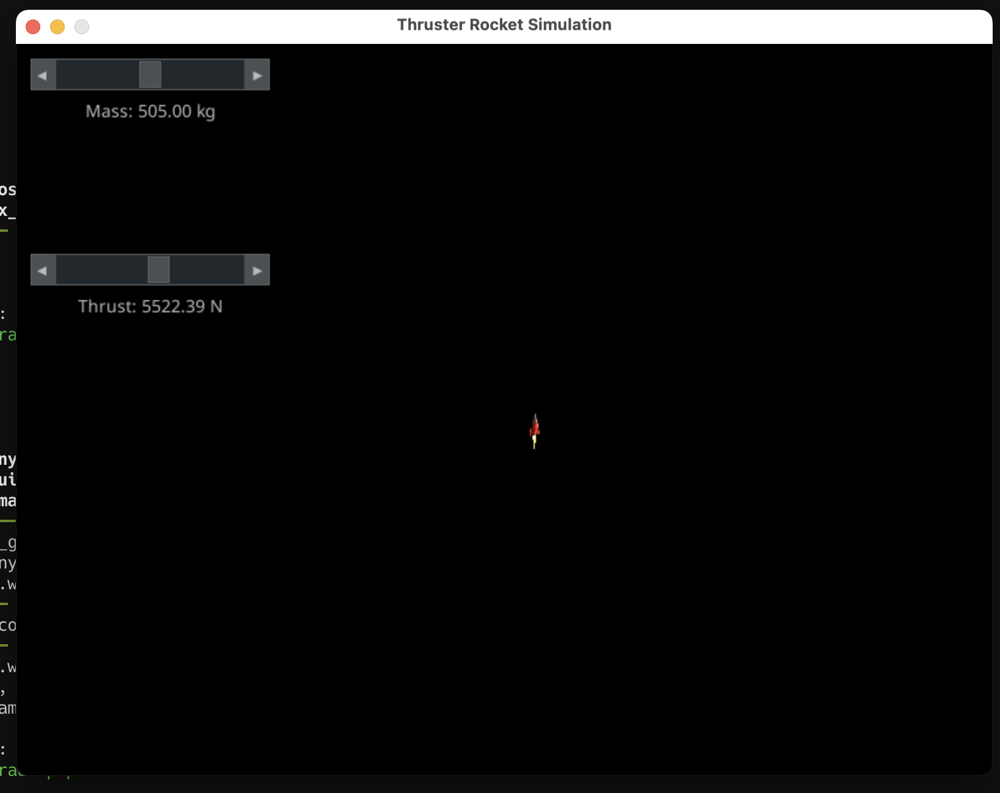
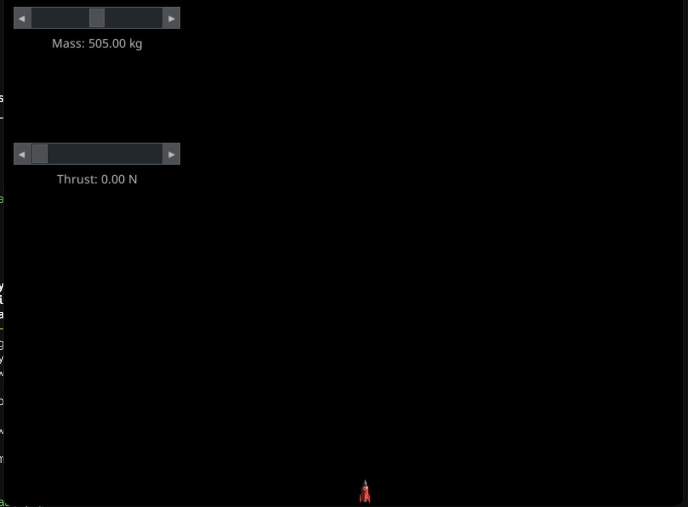

# simple-rocket-simulator
a simulation showcasing the relationship between mass and the thrust needed to push against gravity  

# Install

python -m venv venv
source venv/bin/activate
pip install -r requirements.txt

# Run
python main.py

# Screenshots

